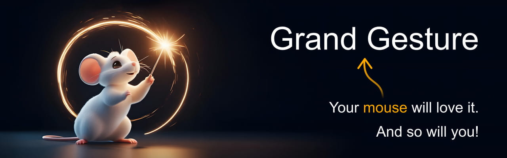

Grand Gesture is the most comprehensive mouse gesture extension for Chrome, featuring mouse gestures, super drag, rocker gestures, wheel gestures, and more. 

This project is a fork of the discontinued [smartUp Gestures](https://github.com/zimocode/smartup) extension by [zimocode](https://github.com/zimocode).

# Installation

[Get it from the Chrome Web Store](https://chromewebstore.google.com/detail/grand-gesture/kmdhnmlelcmpeafnienldlcfchkkajfb)

# Gestures

Actions can be triggered through the following gestures:

- Mouse gestures (draw a line on the screen)

- Super drag (drag selected text, links, and images)

- Rocker gestures (click a mouse button while holding down the other one)

- Wheel gestures (use the scroll wheel while holding down a mouse button)
- Click on the extension icon in the browser's toolbar

- Context menu
- Touch gestures
- Double-click
- Keyboard shortcuts

# Actions

- Navigation
  - Go to the previous or next page (based on the browser history, by following the previous/next links on the page, or by incrementing/decrementing the number in the URL)
  - Go to the parent page (by removing the last path segment from the URL)
  - Reload the page
  - Stop loading the page
  - Open a URL (using either a configurable/fixed URL or the one from the clipboard)

- Tabs
  - Close one or more tabs
  - Open a new tab
  - Switch to the previous/first/last/left/right tab
  - Re-open the previously closed tab
  - Move the current tab to the left/right/start/end
  - Detach one or more tabs into a new window
  - Pin/unpin one or more tabs
  - Duplicate one or more tabs
  - Reopen the current tab in an incognito window
- Windows
  - Open a new window
  - Close one or more windows
  - Minimize/maximize the current window
  - Merge (the tabs of) all windows into a single window
- Text operations (triggered by dragging selected text)
  - Copy the selected text to the clipboard
  - Search the selected text (or the text from the clipboard) via a search engine
  - Create a QR code for the selected text
  - Read the selected text aloud (text-to-speech)
- Link operations (triggered by dragging a link)
  - Open a link
  - Bookmark a link
  - Copy a link's URL, text, or HTML code to the clipboard
  - Create a QR code for a link
  - Save a link
- Image operations (triggered by dragging an image)
  - Open an image
  - Save an image (with or without prompting for a file name/location)
  - Copy an image or its URL to the clipboard
  - Search similar images via a search engine
- Settings
  - Open the Chrome settings
  - Open the Grand Gesture settings
  - Reload Grand Gesture
  - Temporarily disable Grand Gesture in the current tab
- Miscellaneous operations
  - Run custom JavaScript code
  - Copy the page title or URL to the clipboard
  - Bookmark the current page
  - View the page source
  - Save the page
  - Print the page
  - Take a screenshot
  - Open the downloads folder
  - Toggle fullscreen mode
  - Mute one or more tabs
  - Paste text
  - Scroll up/down/left/right or to the start/end
  - Zoom in/out or reset the zoom
  - Create an email with a link to the current page

# Targets

Operations for tabs (e.g., reload, close, mute, ...) can be applied to:

- The current tab
- All tabs
- All tabs except the current tab
- The (single) tab to the left/right of the current tab
- All tabs to the left/right of the current tab
- The current tab and all tabs to its left/right
- The first/last tab

Operations that open a URL (e.g., open a link, view an image, search selected text, ...) can open in:

- The current tab
- A new foreground or background tab
- A new foreground or background window
- An incognito window

# Mini apps

Grand Gesture also contains widgets (called "mini apps") that can be opened on any website:

- List items (to open or switch to)
  - Currently open tabs
  - Recent history (previously viewed/opened websites)
  - Recently closed tabs
  - Bookmarks
  - Synced tabs
- Conversion
  - Convert between lowercase and uppercase
  - Convert a torrent hash to a magnet URI
  - Convert between numeral systems (binary, octal, decimal, hex, ...)
  - Encode and decode base64
  - Generate random numbers
- Miscellaneous
  - Periodically auto-reload the current page
  - RSS
  - List (and run) custom scripts
